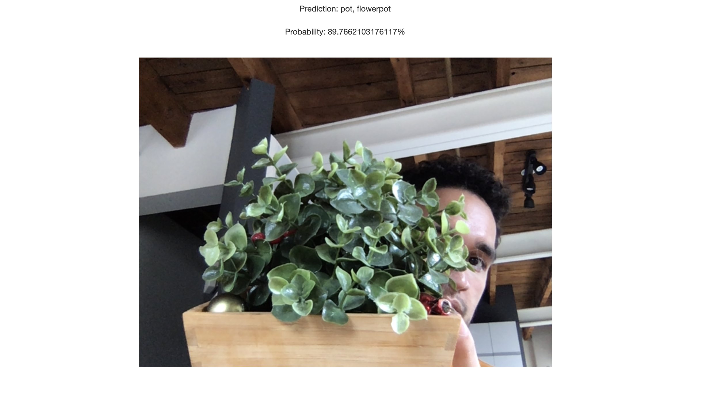
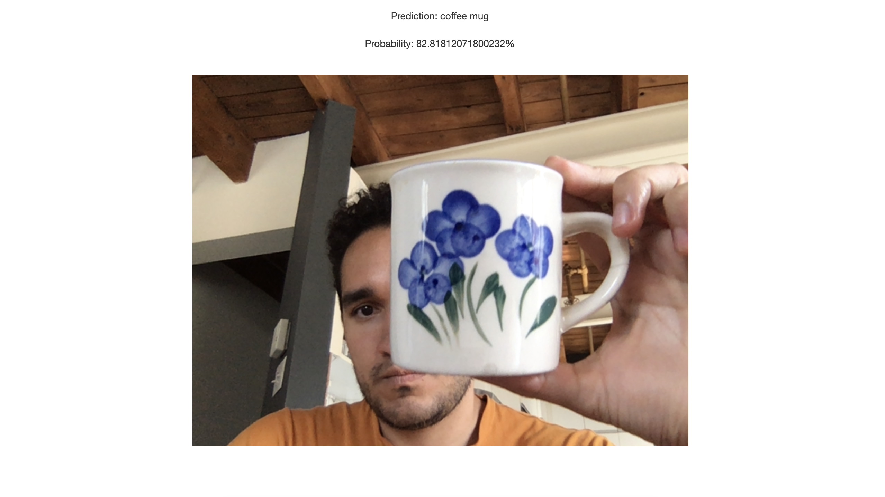
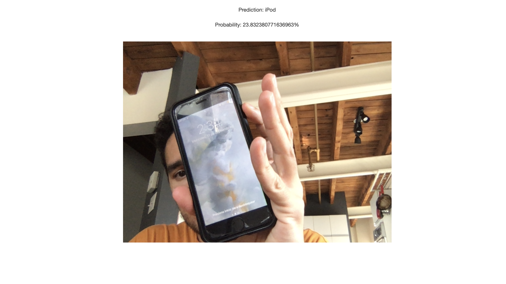

# Let the App Guess
This is an image classfier using tensorflow.js using your webcam on the fly.

## Live demo

https://let-the-app-guess.herokuapp.com

## How it works?

It is train with MobileNet to do image classification in the browser and uses transfer learning, which bootstraps our training with the pre-trained MobileNet model and customizes it to train for your application.

## How to use it?

- Once you copy the repository, simply open index.html in a Web Browser 
- Allow webcam

## Screeshots

  My Flower
  
   
  My Cup
  
   
  My Iphone
  
  

## You may also like
Another other app I have called "My first teachable machine":
https://github.com/zeajose/first-teachable-machine
